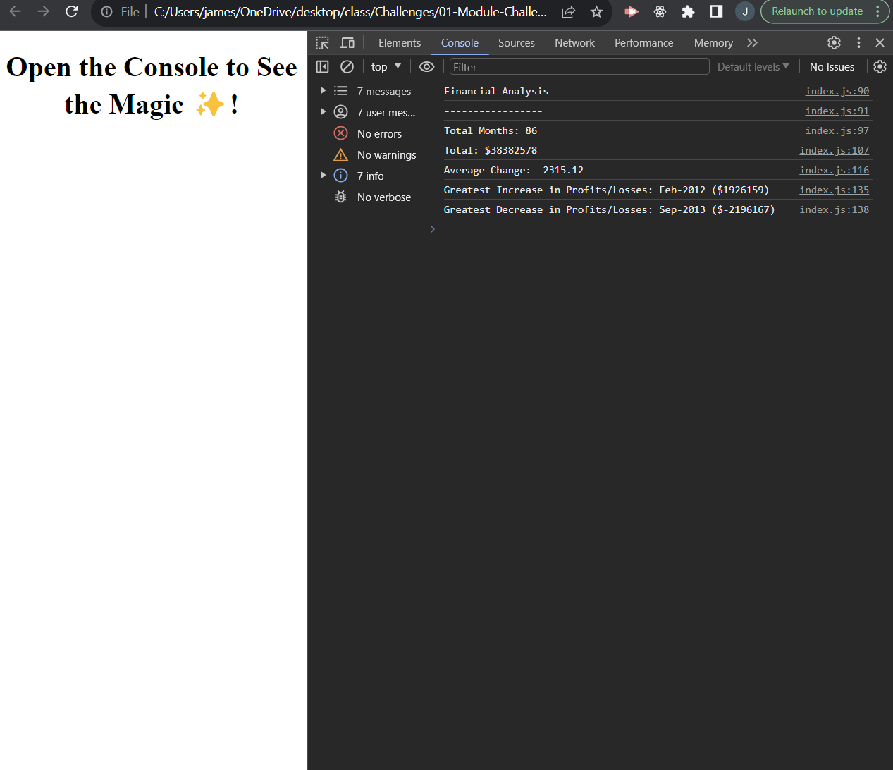

# Console-Finances

## Introduction

This project was part of a weekly challenge in my bootcamp. The aim was to practice using Javascript. 
I was given an array made up of the P&L monthly accounts - 86 months worth. Where i had to perform a few calculations as required and show these resutls clearly in the Console. 

## Features

Personal Introduction: Write javascript to calcualte the required information from the P&L array. 

Navigation: Opening the console will show a breakdown of the results required. 

## Links

For a live URL of the portfolio, click here: https://jsneath.github.io/Console-Finances/

Github URL: https://github.com/jsneath/Console-Finances

